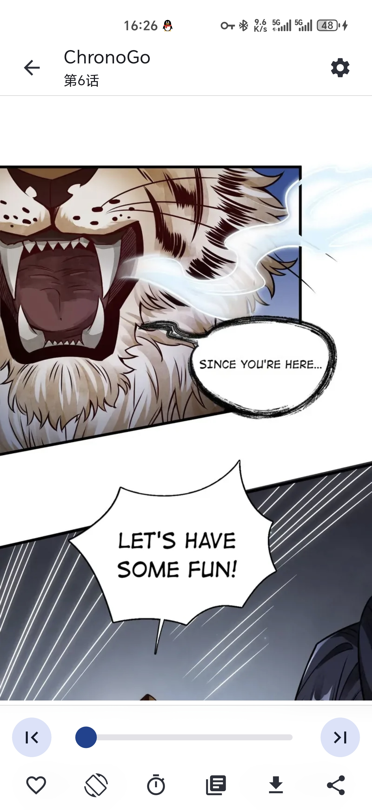
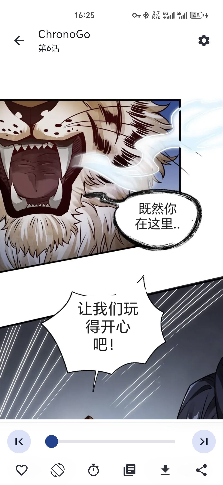
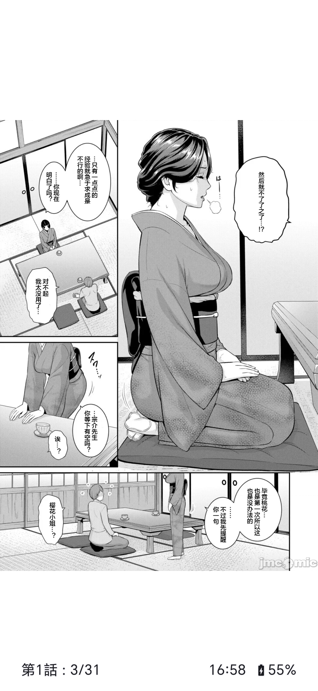
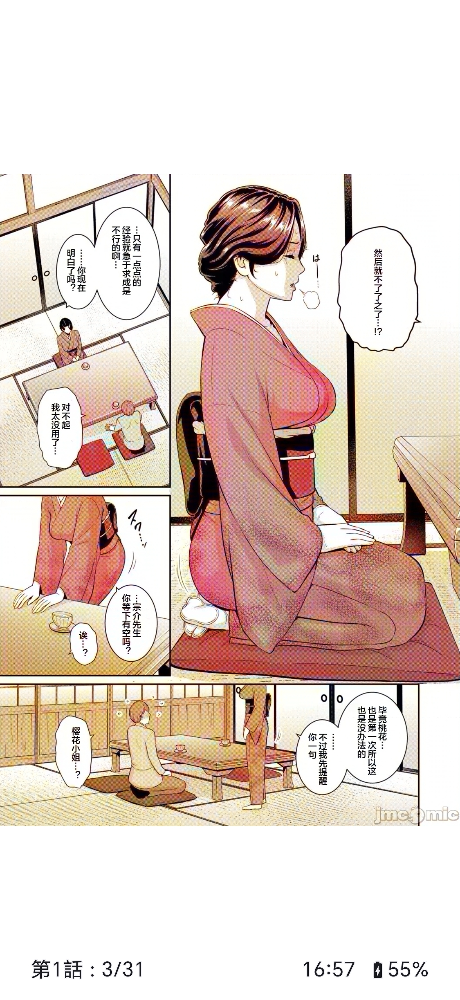
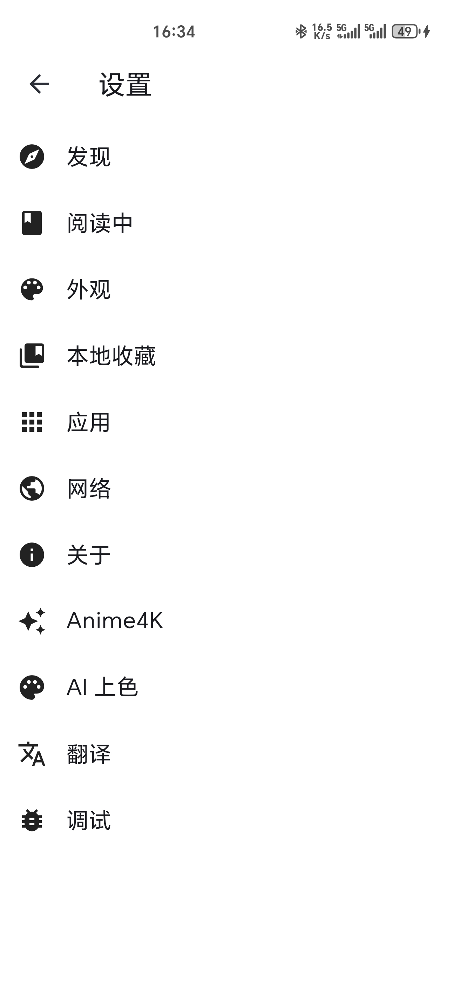

# Venera-SSR

A revision comic reader
support different resource source  
use anime4k to SR.
Black and white cartoon 
via ocr Translate Picture Embedded Text（MML Local inference high quality translation）
All running locally

一个支持不同漫画源，anime4k超分辨率，本地黑白漫画上色，本地ocr翻译的改版漫画阅读器

## Features

黑白漫画上色
Black and white cartoon coloring
（正在 feature/colorization 分支测试本地 AI 实时黑白漫画上色功能的更多可选模型）

支持webdav同步

正在feature/translation-embed分支测试漫画文字替换翻译功能
Cartoon embedded text translation function

- Read local comics
- Use javascript to create comic sources
- Read comics from network sources
- Manage favorite comics
- Download comics
- View comments, tags, and other information of comics if the source supports
- Login to comment, rate, and other operations if the source supports

## 界面展示 (Screenshots)

### 漫画文字翻译 (Comic Text Translation)

| 翻译前 (Before) | 翻译后 (After) |
|:---:|:---:|
|  |  |

### 黑白漫画 AI 上色 (Black & White Cartoon Coloring)

> 使用 int8 轻量模型，在线实时播放
> Uses int8 lightweight model, online real-time playback

| 上色前 (Before) | 上色后 (After) |
|:---:|:---:|
|  |  |

### 其他界面 (Other Screenshots)

| 漫画源 (Comic Source) | 设置菜单 (Settings) |
|:---:|:---:|
|  |  |
| **Anime4K 设置** | **阅读界面 (Reader)** |
|  |  |

## Build from source
1. Clone the repository
2. Install flutter, see [flutter.dev](https://flutter.dev/docs/get-started/install)
3. Install rust, see [rustup.rs](https://rustup.rs/)
4. Build for your platform: e.g. `flutter build apk`

## Create a new comic source
See [Comic Source](doc/comic_source.md)

## Thanks

### particularly thanks

Modify and add functions based on
[Venera](https://github.com/venera-app/venera)

### Tags Translation

## Headless Mode
See [Headless Doc](doc/headless_doc.md)

The Chinese translation of the manga tags is from this project.

#免责声明

不得利用本项目进行任何非法活动。 不得干扰任何公司或个人的正常运营或生活和著作权。 不得传播恶意软件或病毒。 此外，为降低法律风险

🚫禁止在官方平台（如b站）及官方账号区域（如b站微博评论区）宣传本项目

🚫禁止在微信公众号平台宣传本项目

🚫禁止利用本项目牟利，本项目无任何盈利行为，第三方盈利与本项目无关

代码均来自开源项目或AI
